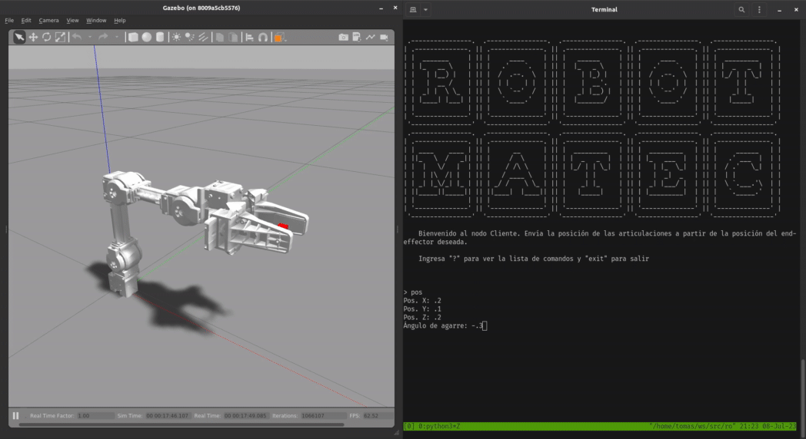
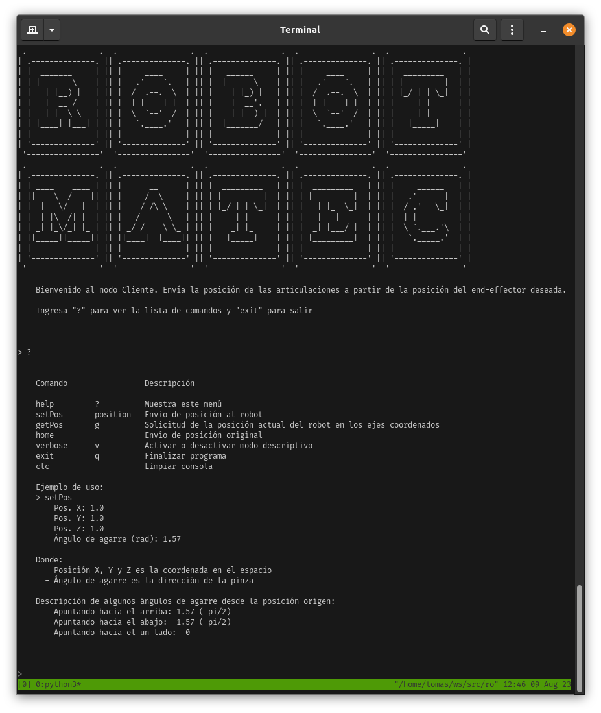

# Cinemática inversa y directa aplicada

<p align="center">
  
</p>

## Descripción

La cinemática de robots es el campo de investigación que estudia el movimiento de cadenas
articuladas con múltiples grados de libertad. Este proyecto es resultado de una propuesta
por parte de docentes del área de matemáticas que decidimos llevar al campo de la robótica
para demostrar una de las tantas aplicaciones del álgebra lineal, planteando un problema
cuya base es lograr el movimiento de las articulaciones de un brazo robótico empleando
transformaciones lineales.

Este proyecto puede ser utilizado de manera educativa tanto para demostrar los coneptos
matemáticos relacionados con coordenadas homogéneas y [parámetros de Denavit–Hartenberg](https://en.wikipedia.org/wiki/Denavit%E2%80%93Hartenberg_parameters)
como para permitir un primer contacto con la robótica utilizando una simulación del robot
open-source [OpenManipulator-X](https://emanual.robotis.com/docs/en/platform/openmanipulator_x/overview/).

<p align="center">
  
</p>

El trabajo de programación realizado consistió en, al entorno simulado de [OpenManipulator-X](https://emanual.robotis.com/docs/en/platform/openmanipulator_x/overview/),
añadir dos componentes que implementan la solución matemática desarrollada:

- **`/transformations/transform`** ROS Service: Toma como parámetro una coordenada del
  espacio (x, y, z) y un ángulo de agarre, y utilizando las fórmulas de cinemática inversa
  desarrolladas calcula los parámetros del robot, o ánglos de las articulaciones, para que
  la posición de el _end-effector_ coincida con los parámetros dados.

- **`Client CLI`**: Es la interfaz que utilizará el usuario para interactuar con el servicio
  anterior y luego enviar los resultados al controlador del robot.

Estos componentes son parte del paquete de ROS `robot_kinematics` provisto en este repositorio.

El desarrollo matemático del proceso se encuentra en el documento [`docs/theory/robot-kinematics.pdf`](https://github.com/b-Tomas/robot-kinematics/blob/main/docs/theory/robot-kinematics.pdf).

## Configuración del entorno y utilización

Se recomienda utilizar la configuración de Docker proporcionada. Para obtener instrucciones sobre cómo construir y ejecutar el entorno de Docker, válido tanto para sistemas basados en Linux como en Windows, lea las instrucciones en [`/docker/README.md`](https://github.com/b-Tomas/robot-kinematics/blob/main/docker/README.md).

En caso de que se desee ejecutar el proyecto de una manera diferente, se debe asegurar de cumplir con los siguientes requisitos:
* Ubuntu 20.04
* ROS Noetic Ninjemys
* Las dependencias listadas en `docker/requirements.txt` instaladas.

Una vez cumplidas dependencias de sistema, desde el interior del contenedor, navegar hasta la carpeta `openmanipulator_x` y clonar los repositorios de _OpenManipulator_ utilizando `vsctool`:

```sh
cd ~/ws/src/robot-transformations/openmanipulator_x
vcs import < robotis.repos
```

Luego construya el proyecto:

```sh
cd ~/ws/
catkin_make
```

Active el overlay (recuerde ejecutar este paso para cada nueva sesión de bash que interactúe con estos paquetes):

```sh
cd ~/ws/
. devel/setup.bash
```

Compruebe los tests:

```sh
rostest robot_kinematics tests.test
```

Para lanzar la simulación, en diferentes paneles de tmux ejecute:

```sh
# Launch simulation, GUI and transformations server
roslaunch robot_kinematics transformations.launch
# Launch the CLI
roslaunch robot_kinematics cli.launch
```

Esto lanzará la simulación en Gazebo, la visualización en RViz, el controlador del robot y una
herramienta gráfica para ver y enviar parámetros del robot, además del servicio de transformaciones
y la CLI de este paquete, en la que podrá ejecutar el comando `?` para obtener información sobre su
utilización.

<p align="center">
  
</p>

Antes de enviar una posición, haga click en el botón `Timer Start` en la ventana
`OpenManipulator control GUI`.

Luego, envíe la posición objetivo (0.1, 0.1, 0.2, 0.0) (las unidades de distancia se encuentran en
metros y los ángulos en radianes) y observe en la ventana de control que la posición final del
_end-effector_ es la enviada.

## Autores

Este trabajo fue realizado por los estudiantes de [Ingeniería en Computación](https://ic.info.unlp.edu.ar/)
de las facultades de Ingeniería e Informática de la [Universidad Nacional de La Plata](https://unlp.edu.ar):

- Tomás Badenes
- Juan Martín Seery
- Santiago Adriel Fernández
- Lorenzo Majoros

Se recomienda revisar la carpeta [`docs/theory/`](https://github.com/b-Tomas/robot-kinematics/tree/main/docs/theory) con el desarrollo matemático del proyecto.
