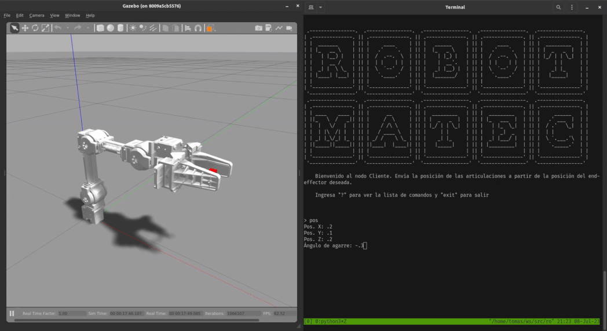
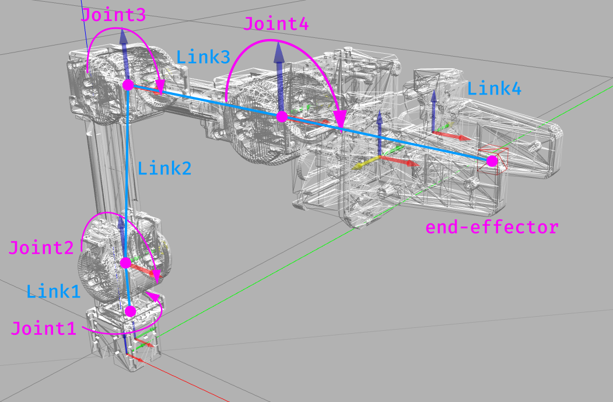
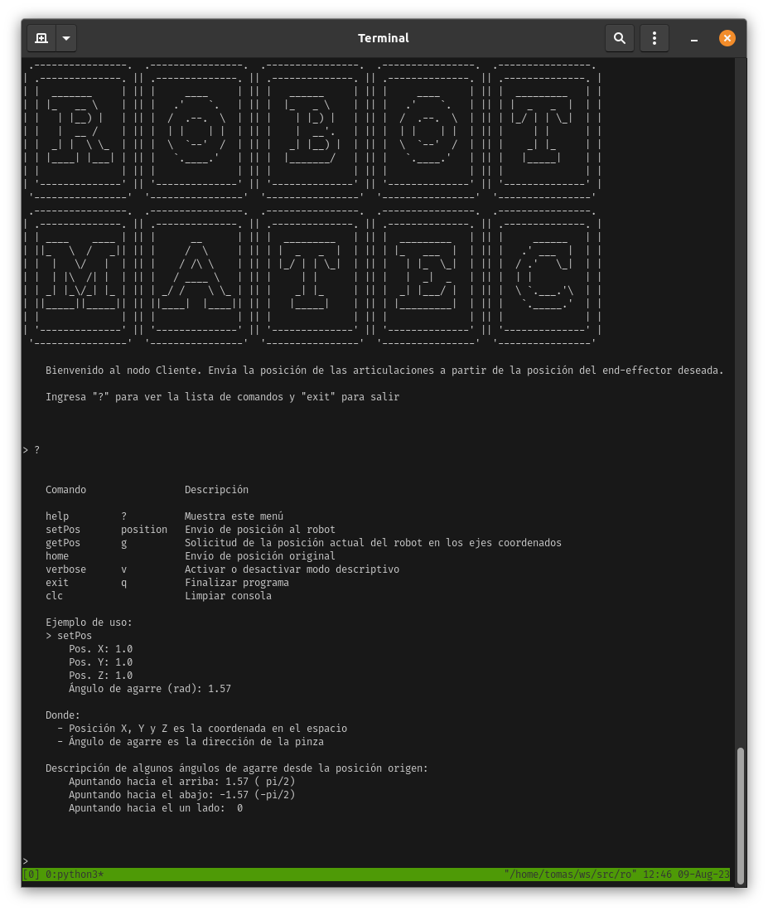

# Applied inverse and forward kinematics

<p align="center">
  
</p>

## Description

Robotic kinematics is the field of research that studies the movement of articulated chains
with multiple degrees of freedom. This project is the result of a proposal by mathematics
educators that we decided to merge with the field of robotics to demonstrate one of the many
applications of linear algebra. We formulated a problem where the goal is to achieve the motion
of the joints of a robotic arm using linear transformations.

This project can be used to demonstrate mathematical concepts related to homogeneous
coordinates and [Denavit–Hartenberg parameters](**https://en.wikipedia.org/wiki/Denavit%E2%80%93Hartenberg_parameters**),
as well as to provide an initial introduction to robotics using a simulation of the open-source robot
[OpenManipulator-X](https://emanual.robotis.com/docs/en/platform/openmanipulator_x/overview/).

<p align="center">
  
</p>

The programming work done involved adding to the simulated environment of
[OpenManipulator-X](https://emanual.robotis.com/docs/en/platform/openmanipulator_x/overview/)
two components implementing the developed mathematical solution:

- **`/transformations/transform`** ROS Service: Takes a parameter of a coordinate in space (x, y, z)
- and a gripping angle. By using the developed inverse kinematics formulas, it calculates the robot's 
- parameters or joint angles, so that the position of the end-effector matches the given parameters.

- **`Client CLI`**: This is the interface that the user will use to interact with the above service and 
- then send the results to the robot's controller.

These components are part of the ROS package `robot_kinematics` provided in this repository.

The mathematical development of the process can be found in the document [`docs/Robot_Kinematics.pdf`](https://github.com/b-Tomas/robot-kinematics/blob/main/docs/theory/robot-kinematics.pdf).

## Environment setup and usage

It is recommended to use the provided Docker configuration. For instructions on how to build and run the 
Docker environment, valid for both Linux-based and Windows systems, refer to the instructions in [`/docker/README.md`](https://github.com/b-Tomas/robot-kinematics/blob/main/docker/README.md).

If you wish to run the project in a different way, ensure that you meet the following requirements:
* Ubuntu 20.04
* ROS Noetic Ninjemys
* Install the dependencies listed in `docker/requirements.txt`.

Once you have the system dependencies fulfilled, from inside the container, navigate to the `openmanipulator_x` 
folder and clone the _OpenManipulator_ repositories using `vcs tool`:

```sh
cd ~/ws/src/robot-transformations/openmanipulator_x
vcs import < robotis.repos
```

Then build the project:

```sh
cd ~/ws/
catkin_make
```

Source the overlay (remember to execute this step for each new bash session that interacts with these packages):

```sh
cd ~/ws/
. devel/setup.bash
```

Run the tests:

```sh
rostest robot_kinematics tests.test
```

To launch the simulation, in different tmux panels, execute:

```sh
# Launch simulation, GUI, and transformations server
roslaunch robot_kinematics transformations.launch
# Launch the CLI
roslaunch robot_kinematics cli.launch
```

This will launch the Gazebo simulation, the RViz visualization, the robot's controller, a GUI to view and 
send robot parameters, the transformations service, and the CLI for this package. In the CLI, you can execute 
the command `?` to get information on its usage.

<p align="center">
  
</p>

Before sending a position, click the `Timer Start` button in the `OpenManipulator control GUI` window.

Then, send the target position (0.1, 0.1, 0.2, 0.0) (distance units are in meters, and angles are in radians)
and observe in the control window that the final position of the end-effector matches the sent position.

## Authors

This work was carried out by students of [Computer Engineering](https://ic.info.unlp.edu.ar/) from the faculties 
of Engineering and Computer Science at the [National University of La Plata](https://unlp.edu.ar):

- Tomás Badenes
- Juan Martín Seery
- Santiago Adriel Fernández
- Lorenzo Majoros

It is recommended to review the folder [`docs/theory/`](https://github.com/b-Tomas/robot-kinematics/tree/main/docs/theory) 
for the mathematical development of the project.
